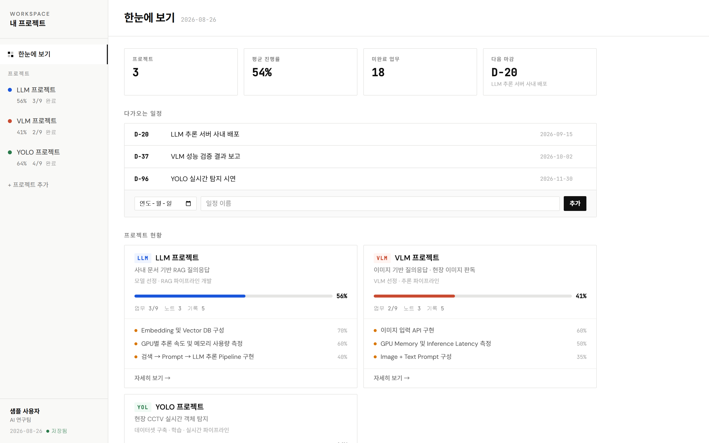
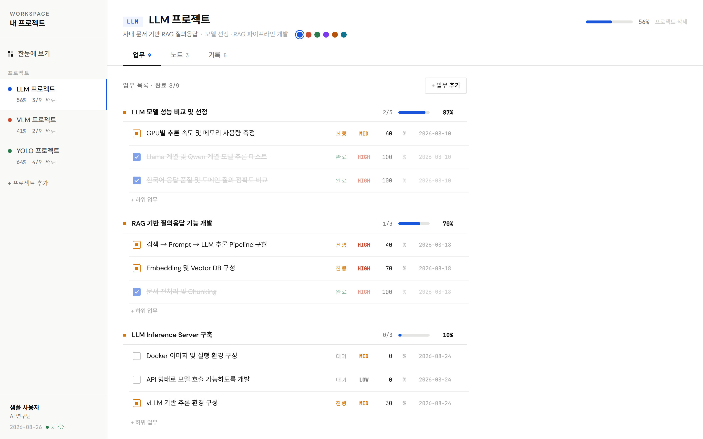
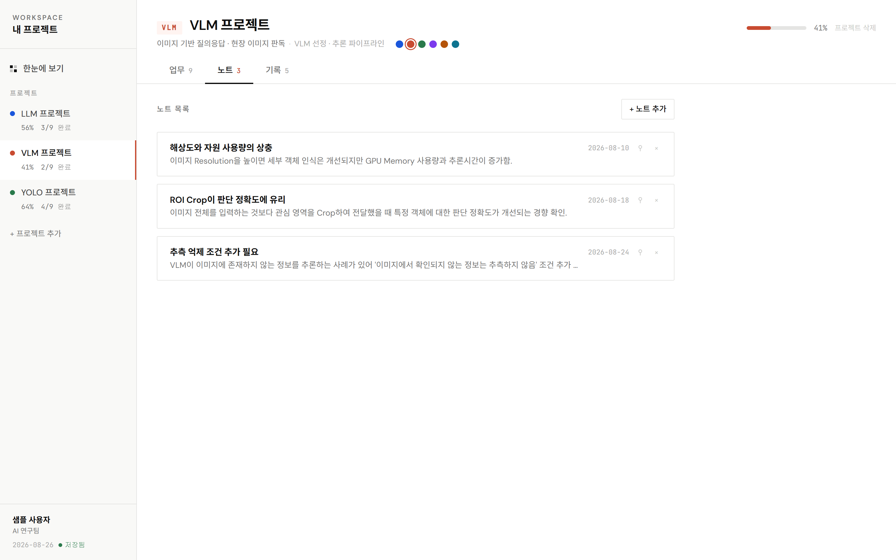
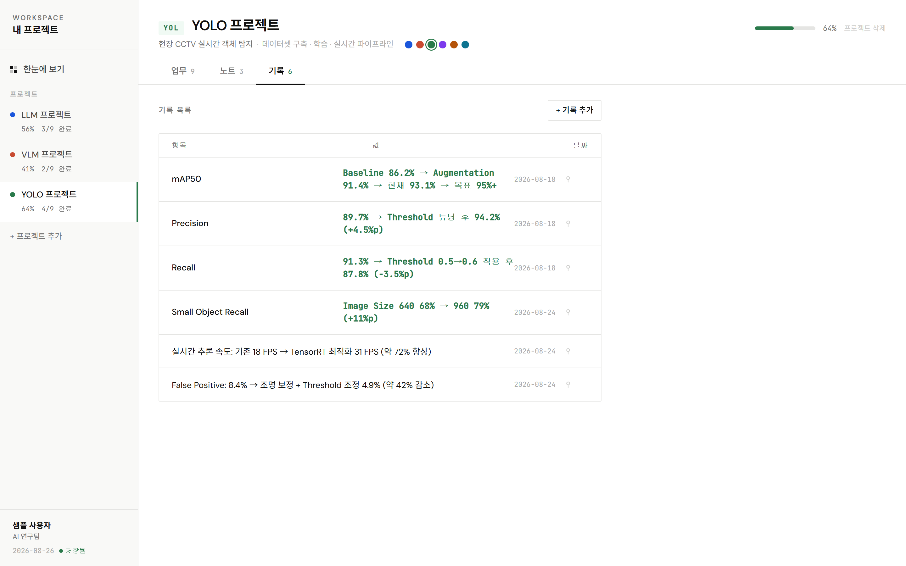

# 프로젝트 대시보드 (로컬)

내 PC에서만 돌아가는 프로젝트 관리 대시보드. 인터넷으로 나가는 통신은 없습니다
(글꼴만 온라인에서 받아오고, 안 되면 기본 글꼴로 대체됩니다).

## 화면

아래는 예시 데이터(`data.sample/`)로 실행한 모습입니다. 받은 직후 그대로 실행하면 이 화면이 나옵니다.

### 한눈에 보기

프로젝트 수·평균 진행률·미완료 업무·다음 마감을 위에 요약하고, D-day 일정과 프로젝트 현황
카드, 전 프로젝트를 합친 우선 처리 업무, 메모를 한 화면에 놓습니다.



### 업무 — 대주제 + 하위 업무

개요를 붙여넣으면 들여쓴 줄이 하위 업무가 됩니다. 대주제 줄의 `완료수/전체` 와 진행률은
하위 업무에서 자동으로 계산되고, 완료된 항목은 그룹 안에서 아래로 내려갑니다.



### 노트

제목 + 본문. 카드를 클릭하면 펼쳐지고, 압정을 누르면 최상단에 고정됩니다.



### 기록

**양식**(항목 + 값)과 **무양식**(자유 한 줄)을 한 표에 섞어 쓸 수 있습니다.
아래에서 위 네 줄은 양식, 아래 두 줄은 무양식입니다.



## 실행

Windows + [Node.js](https://nodejs.org) 18 이상이면 됩니다. 받은 폴더에서:

```bash
run.bat
```

바탕화면 바로가기를 만들려면 **`create-shortcut.bat`** 을 한 번 실행하세요.
아이콘·작업 폴더까지 잡힌 "프로젝트 대시보드" 바로가기가 바탕화면에 생기고,
이후에는 더블클릭만으로 열립니다. (콘솔 창은 최소화 상태로 떠서 화면을 가리지 않습니다)

`run.bat` → `launch.mjs` 순서로 실행되고, 하는 일은 패키지 설치(처음 1회) → 소스가 바뀌었으면
빌드 → 로컬 서버 실행 → 브라우저 자동 열기 (http://127.0.0.1:5187). 콜드 스타트 약 0.7초.

종료는 검은 콘솔 창을 닫으면 됩니다. 이미 켜져 있는 상태에서 바로가기를 다시 누르면
새로 띄우지 않고 브라우저 탭만 엽니다.

### 주소는 127.0.0.1 을 쓴다

Windows 의 `localhost` 는 IPv6(`::1`)로 먼저 풀린다. 그래서 서버는 `127.0.0.1` 과 `::1`
**둘 다** 듣는다(둘 다 이 PC 안에서만 접속 가능). 한쪽만 듣게 하면 브라우저가 실패한 뒤
다시 시도하느라 첫 화면이 2초 이상 늦게 뜬다.

## 데이터

| 항목 | 위치 |
| --- | --- |
| 실제 데이터 | `data/dashboard-data.json` |
| 자동 백업 | `data/backup/dashboard-data.YYYY-MM-DD.json` (그날 첫 저장 시 1회) |

- 화면에서 뭔가 고치면 0.4초 뒤 자동 저장됩니다. 사이드바 아래 **저장됨 / 저장 중** 표시로 확인.
- 저장은 임시 파일에 쓴 뒤 교체하는 방식이라, 저장 중에 창을 닫아도 파일이 깨지지 않습니다.
- 서버가 안 떠 있는 상태로 브라우저만 열려 있으면 **임시저장**(브라우저 localStorage)으로
  전환됩니다. 이때 적은 내용은 파일에 안 들어가니, `run.bat` 으로 켜서 쓰세요.
- 백업/이관은 `data` 폴더만 복사하면 됩니다.

## 화면 구성

- **한눈에 보기** — 요약 타일(프로젝트 수·평균 진행률·미완료 업무·다음 마감),
  D-day 일정, 프로젝트 현황 카드, 전 프로젝트 우선 처리 업무, 메모 타임라인.
  프로젝트 카드의 이름·설명·역할은 클릭해서 바로 수정.
  - 메모의 **프로젝트 지정 →** 을 고르면 그 메모가 해당 프로젝트의 노트로 옮겨간다.
    첫 줄이 노트 제목, 나머지가 본문이 되고 메모 목록에서는 사라진다.
- **프로젝트별 화면** — 업무 / 노트 / 기록 탭.
  머리말의 코드(LLM 등)·이름·설명·역할을 클릭해서 수정하고, 색점 6개로 프로젝트 색을 바꾼다.
  - 업무: 체크박스를 누르면 대기 → 진행 → 완료 순환. 진행률(%)·우선순위·업무명 모두 인라인 수정.
  - 업무는 **대주제 + 하위 업무** 2단 구조. `+ 업무 추가` 칸에 개요를 그대로 붙여넣으면
    들여쓴 줄이 바로 위 대주제의 하위 업무로 등록된다 (글머리표 `*` `-` `1.` 무관, 탭·공백 모두 인식).

    ```
    * LLM 모델 성능 비교 및 선정
       * Llama 계열 및 Qwen 계열 모델 추론 테스트
       * GPU별 추론 속도 및 메모리 사용량 측정
    ```

    대주제 줄에는 `완료수/전체` 와 진행률 막대가 나오고, 그 값은 하위 업무의 평균으로
    자동 계산된다(대주제는 직접 수정하지 않는다). 대주제를 지우면 하위 업무도 함께 지워진다.
  - 프로젝트 진행률·업무 개수는 실제 작업 단위(하위 업무 + 단독 업무)만 세고 대주제는 제외한다.
  - 노트: 제목 + 본문. 카드를 클릭하면 펼쳐짐.
  - 기록: 두 가지 방식을 섞어 쓸 수 있다. 추가 폼에서 **양식 / 자유** 를 고른다.
    - **양식** — 항목 + 값. 예: `GPU 사용 시간` = `128h` (값은 프로젝트 색으로 강조)
    - **자유** — 형식 없이 한 줄. 예: `mAP (baseline) 65%, 현재 70%, 목표 90%`
      여러 줄을 쓰면 줄마다 한 건씩 등록된다 (Ctrl+Enter 저장). 표에서는 항목·값 칸을
      합쳐 한 줄로 보여준다.
    - 양쪽 다 표에서 클릭해 바로 수정할 수 있다. 데이터상 `text` 가 있으면 자유 형식.
  - 노트·기록 **고정**: 압정 아이콘을 누르면 최상단으로 고정(테두리·배경이 프로젝트 색).
    여러 개 고정하면 방금 고정한 것이 맨 위. 다시 누르면 해제되고 추가된 시간 순으로 복귀.
    (`pinnedAt` 값으로 저장되며, 없으면 고정 안 된 항목)

## 소스 수정

```bash
npm run dev
```

`npm run dev` 은 5188 포트에서 열리고 저장 API는 5187(로컬 서버)로 넘기므로,
서버(`node server.mjs`)를 따로 띄워둔 상태에서 쓰세요. 수정이 끝나면 `run.bat` 이
다음 실행 때 자동으로 다시 빌드합니다.

| 파일 | 역할 |
| --- | --- |
| `src/App.tsx` | 화면 배치와 프로젝트 추가·삭제만. 항목 편집 로직은 각 탭에 있다 |
| `src/Sidebar.tsx` | 왼쪽 목록 (한눈에 보기 / 프로젝트 / 프로필·저장 상태) |
| `src/ProjectHeader.tsx` | 프로젝트 머리말 — 코드·이름·설명·역할 수정, 색상, 탭 |
| `src/tabs/TasksTab.tsx` | 업무 탭 — 대주제/하위 업무 목록과 개요 등록 |
| `src/tabs/NotesTab.tsx` | 노트 탭 |
| `src/tabs/RecordsTab.tsx` | 기록 탭 — 양식/무양식 |
| `src/Overview.tsx` | 한눈에 보기 탭 |
| `src/ui.tsx` | 여러 화면이 함께 쓰는 조각 (MONO, RADIUS, 진행률 막대, 압정, 저장 배지 등) |
| `src/store.ts` | 불러오기·자동 저장 (한 번에 하나씩 순서대로, localStorage 대체 포함) |
| `src/Editable.tsx` | 클릭해서 고치는 텍스트 (한글 IME 안전한 input 방식) |
| `src/types.ts` | 데이터 타입과 계산 (진행률, D-day, 개요 파싱, 고정 정렬) |
| `server.mjs` | 정적 파일 서빙 + `/api/state` 읽기/쓰기 (의존성 0) |
| `launch.mjs` | 실행 준비: 패키지 설치·재빌드 판단 후 서버 시작 |
| `run.bat` | 바로가기가 부르는 진입점 (한글은 cmd 에서 깨지므로 ASCII 로만 작성) |
| `create-shortcut.bat` + `tools/create-shortcut.ps1` | 바탕화면 바로가기 생성 |
| `data.sample/dashboard-data.json` | 예시 데이터 (첫 실행 시 `data/` 로 복사됨) |

## 깃으로 관리할 때

`data/` 는 **개인 데이터라 깃에 올리지 않습니다** (`.gitignore` 에 포함). 대신 예시 데이터를
`data.sample/dashboard-data.json` 으로 함께 배포합니다.

- 처음 실행하면 서버가 `data/dashboard-data.json` 이 없는 것을 보고 예시 데이터를 복사해
  만듭니다. 콘솔에 `[데이터 새로 만듦] data.sample → …` 이 찍힙니다.
- 예시 데이터에는 LLM / VLM / YOLO 3개 프로젝트가 들어 있습니다. 대주제 9개와 하위 업무 27개,
  노트 9건, 기록 16건(양식·무양식 섞음), 미분류 메모 2건, 마감 3건.
- 쓰던 데이터를 다른 PC로 옮기려면 `data` 폴더만 복사하면 됩니다.
- 예시 데이터를 다시 보고 싶으면 `data` 폴더를 지우고 다시 실행하세요 (지우기 전에 백업할 것).
